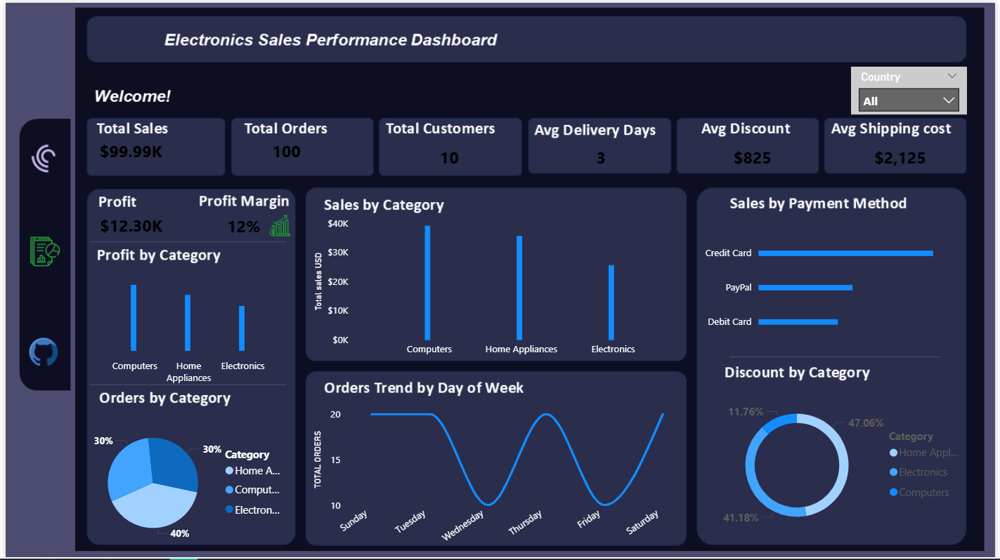
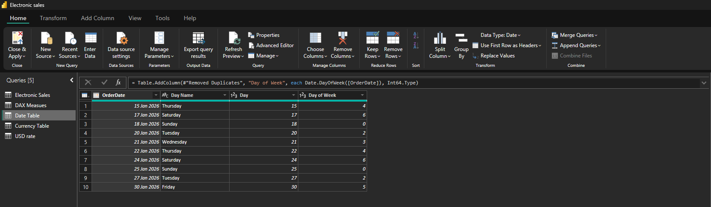

## Electronic Sales Performance Using Power BI.
This is an end to end project given to us in our Assignemnt No. 3 at LuxDevHq.  

The objective of the project is to provide valuable insights into electronic sales business.

Final project preview.
- Dashboard



- Report 1


- Report 2


## Dataset Dictionary
1. OrderID	
2. CustomerName	
2. City	
3. Country	
4. Region
5. ProductName
6. Category
7. SalesAmount
8. Quantity
9. Discount	
10. OrderDate	
11. DeliveryDate
12. PaymentMethod
13. SalesRep
14. ShippingCost
15. Profit
16. Currency
17. CustomerAge
18. CustomerEmail

## Tool used to analys & represent the Sales


-Key Performance Indicator (KPIs)

-Dax Measures

-Data Modelling

-Visualisation

-Slicers

-Navigation Panel


## 1. Data Preparation & Cleaning

I checked for missing values, and duplicates. 

The data did not need alot of cleaning, however, after working on a few measures and visualisations, I came back to do some data preparation. I created 2 new Dimension Tables linked to the Facts table (Electronic Sales)

- Date Table for time series sales analysis
- Currency Table for storing USD and CAD currency 



I linked the two tables through One to Many relationship with the electronic sales table (Fact Table).


I went ahead and created a separate table to store Dax Measures.


 
The dataset had two currencies, USD and CAD. Calculating the total sales or profit with two different currencies wouln't make sense. As such, I created a reusable measure that converted the CAD to USD. I had to reaserch that; Watched a few tutorials and engaged AI to understand the code. 

Currency Convertion code:

```
USD Currency Converter = 
    VAR Curr = SELECTEDVALUE('Electronic Sales'[Currency])
        RETURN 
            CALCULATE(
                MAX('Currency Table'[USD]),
                'Currency Table'[Currency] = Curr
            )
```
Aftter which, I used the measure to calculate Total Sales:

```
Total sales USD = 
SUMX(
    'Electronic Sales',
    'Electronic Sales'[SalesAmount]*COALESCE([USD Currency Converter],1)
)
```
I used the reusable measure to find the Profit, Avg Discount and Shipping cost. 

I calculated the Nomber of customers using DISTINCTCOUNT:
```
TOTAL CUSTOMERS = 
    DISTINCTCOUNT('Electronic Sales'[CustomerName]
    )
```
I applied the same logic to count No. of Sales Rep, Products and Cities.

## Data visualisation

To make my dashboard presentable, I created a wireframe using power point to design where and how my KPIs and Charts will be displayed. 

-Barcharts

-PieChart

-DonutChart

-Column Chart

-Table

-Custom Map

## Sales performance 

- computers drive more sales and profit compared to other electronic devices;

- Sunday, Tuesday, Thursday & Saturday are the best performing sales days of the week;

- Home appliances derive more sales in terms of discount category. 

- Top 3 best performing sales by cities are: Toronto, Boston, and Montreal. 

- Charlie is the best performing Sales Rep for having sold 472,990 in the month of January sales Analysis

## Recommendation

- Introduce redeemable loyalty points for credit card payments to encourage more sales.


